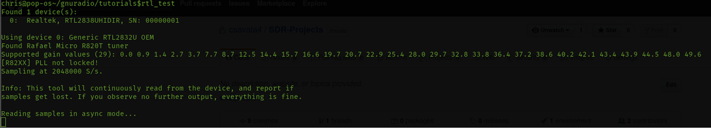

hello
=====

**You are here!**
## Installation of rtl-sdr and gnuradio on Ubuntu 20.04 LTS
### Introduction to  setting up Nooelec NESDR SMArt v4
I chose the Nooelec NESDR SMArt v4 as a pilot model to delve further into the heart of signal processing. 
* First, insert the SDR dongle into the computer's USB port. Connect the antenna to the SDR. (Include antenna specs later)
  * Run the command `lsusb`. This will show all the USB devices attached to the computer.
  * The NESDR should be listed as `Realtek Semiconductor Corp. RTL2838 DVB-T`. `DVB-T` means that the OS has recognized the device and loaded what it believes to be the correct driver. The default use is set to recieve television broadcasts.
  * Run the command `lsmod | grep dvb` to list the loaded modules with the letters `dvb`
  * To use the device as an SDR we must blacklist the default modules.
  * Edit the `/etc/modprobe.d/blacklist-dvb.conf` file by adding the following to the file: `blacklist dvb_usb_rtl28xxu`, save, and close the file. This will exclude the default drivers to load.
  * To allow the driver we want, we will need to run the command `sudo apt-get install rtl-sdr`. This includes the utilities and drivers we need related to using the SDR.
  * Now that the SDR is set up, test it by running `rtl_test`. This will test the device and its functions. At this point, the screen should stop printing.
  * The completion of these steps should load the modules and libraries needed to run the SDR.
  
### Installation of gnuradio 3.8xx and the configuration with Nooelec NESDR SMArt v4
One of the problems I encountered after the installation of the SDR, was wanting to use the gnuradio framework to program simulation blocks to as a source for the SDR.  I realized there were wasn't much support with 20.04 LTS and gnuradio v3.8x. This led to problems with RTL-SDR blocks and OsmoSDR blocks when configuring the tests. The following series of commands were a successful attempt at configuring gnuradio v3.8 and its gnuradio-companion GUI to communicated with the SDR.
* First, if gnuradio is not installed, run `sudo apt install gnuradio`.
* Now, we just want to make sure the dependencies for gnuradio--and everything else we need is installed prior to configuration. We can run `apt-get build-dep gnuradio` and `apt-get install git python3-dev libgmp-dev python3-mako libfaad-dev python3-numpy python3-gi-cairo libgtk-3-dev python3-pyqt5 librtlsdr-dev pulseaudio` to make sure everything is installed.
  * We will make a directory for the gnuradio v3.8xx configuration. Run `mkdir ~/gnuradio38` and now we go into that directory with `cd ~/gnuradio38`.
  * Now we will clone the gnuradio repository and checkout the `maint-3.8` branch.
  ```cloning repo
  git clone --recursive https://github.com/gnuradio/gnuradio.git
  cd gnuradio
  git checkout maint-3.8
  ```
  * We will now change into the Vector-Optimized Library of Kernels(VOLK) directory and create a build directory. We call cmake with the path of the project's parent directory to generate the build scripts. We will then run the script using the Makefile. We then configure the recent shared libraries found in the directories.
  ```cmake gnuradio
  cd volk
  cd ..
  mkdir build
  cd build
  cmake -DCMAKE_BUILD_TYPE=Release -DPYTHON_EXECUTABLE=/usr/bin/python3 -DGR_PYTHON_DIR=/usr/local/lib/python3.7/dist-packages -DENABLE_GRC=ON -DENABLE_GR_QTGUI=ON ../
  make -j8
  sudo make install
  sudo ldconfig
  ```
  * Now we will work on installing the osmosdr resources into the gnuradio-companion.
  ```osmosdr make
  cd ~/gnuradio38
  git clone https://github.com/osmocom/gr-osmosdr
  cd gr-osmosdr
  mkdir build
  cmake -DCMAKE_BUILD_TYPE=Release -DPYTHON_EXECUTABLE=/usr/bin/python3 ../
  make -j8
  sudo make install
  sudo ldconfig
  ```
  * We will now include the gnuradio Digital Audio Broadcasting module(gr-dab).
  ```gr-dab make
  cd ~/gr38
  git clone https://github.com/andrmuel/gr-dab
  cd gr-dab
  mkdir build
  cd build
  cmake -DCMAKE_BUILD_TYPE=Release -DPYTHON_EXECUTABLE=/usr/bin/python3 ../
  make
  sudo make install
  sudo ldconfig
  ```
  * After running these commands succesfully, launch the companion GUI either by clicking on the application or running `gnuradio-companion` in the command line.
  
  
