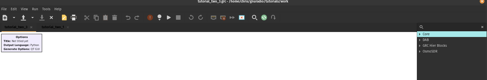
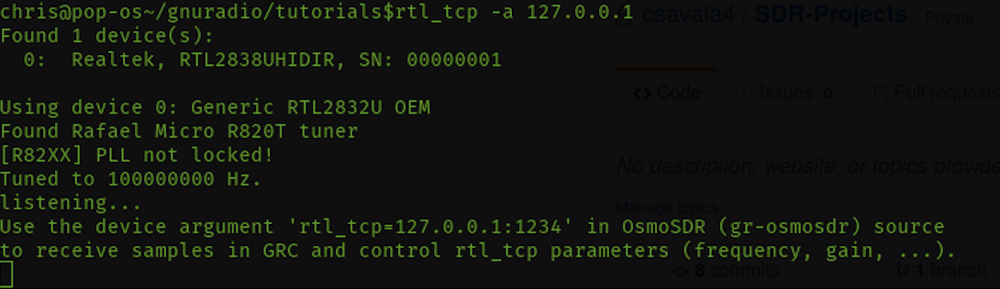
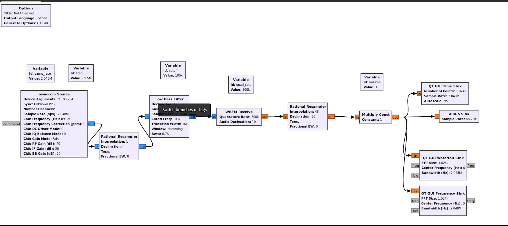
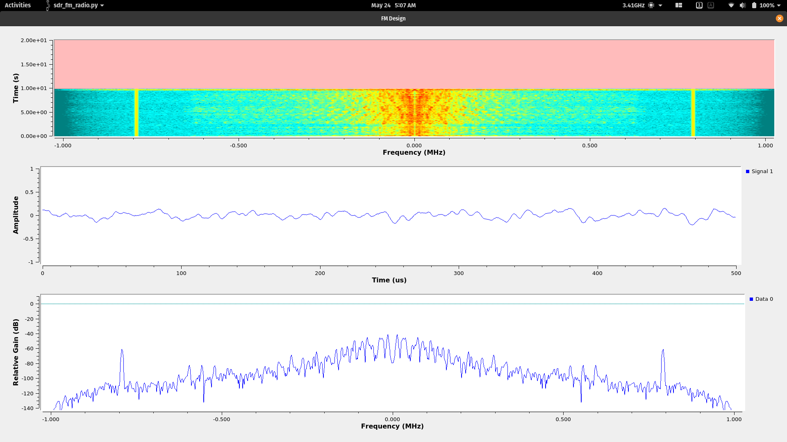

# Installation of rtl-sdr and gnuradio on Ubuntu 20.04 LTS

### Introduction to  setting up Nooelec NESDR SMArt v4
I chose the Nooelec NESDR SMArt v4 as a pilot model to delve further into the heart of signal processing. 
* First, insert the SDR dongle into the computer's USB port. Connect the antenna to the SDR. The antenna used for the FM Receiver design was a `Telescopic quarter-wave 120MHz-475MHz antenna`. This antenna covers commercial FM broadcasts pretty well.  
  * Next, Run the command `lsusb`. This will show all the USB devices attached to the computer.
  * The NESDR should be listed as `Realtek Semiconductor Corp. RTL2838 DVB-T`. `DVB-T` means that the OS has recognized the device and loaded what it believes to be the correct driver. The default use is set to recieve television broadcasts.
  * Run the command `lsmod | grep dvb` to list the loaded modules with the letters `dvb`
  * To use the device as an SDR we must blacklist the default modules.
  * Edit the `/etc/modprobe.d/blacklist-dvb.conf` file by adding the following to the file: `blacklist dvb_usb_rtl28xxu`, save, and close the file. This will exclude the default drivers to load.
  * To allow the driver we want, we will need to run the command `sudo apt-get install rtl-sdr`. This includes the utilities and drivers we need related to using the SDR.
  * Now that the SDR is set up, test it by running `rtl_test`. This will test the device and its functions. At this point, the screen should stop printing.
  * The completion of these steps should load the modules and libraries needed to run the SDR.
  
### Installation of gnuradio 3.8xx and the configuration with Nooelec NESDR SMArt v4
One of the problems I encountered after the installation of the SDR, was wanting to use the gnuradio framework to program simulation blocks to as a source for the SDR.  I realized there were wasn't much support with 20.04 LTS and gnuradio v3.8x. This led to problems with RTL-SDR blocks and OsmoSDR blocks when configuring the tests. The following series of commands were a successful attempt at configuring gnuradio v3.8 and its gnuradio-companion GUI to communicated with the SDR.
* First, if gnuradio is not installed, run `sudo apt install gnuradio`.
* Now, we just want to make sure the dependencies for gnuradio--and everything else we need is installed prior to configuration. We can run `apt-get build-dep gnuradio` and `apt-get install git python3-dev libgmp-dev python3-mako libfaad-dev python3-numpy python3-gi-cairo libgtk-3-dev python3-pyqt5 librtlsdr-dev pulseaudio` to make sure everything is installed.
  * We will make a directory for the gnuradio v3.8xx configuration. Run `mkdir ~/gnuradio38` and now we go into that directory with `cd ~/gnuradio38`.
  * Now we will clone the gnuradio repository and checkout the `maint-3.8` branch.
  
  ```bash
  git clone --recursive https://github.com/gnuradio/gnuradio.git
  cd gnuradio
  git checkout maint-3.8
  ```
  
  * We will now change into the Vector-Optimized Library of Kernels(VOLK) directory and create a build directory. We call cmake with the path of the project's parent directory to generate the build scripts. We will then run the script using the Makefile. We then configure the recent shared libraries found in the directories.
  
  ```bash
  cd volk
  cd ..
  mkdir build
  cd build
  cmake -DCMAKE_BUILD_TYPE=Release -DPYTHON_EXECUTABLE=/usr/bin/python3 -DGR_PYTHON_DIR=/usr/local/lib/python3.7/dist-packages -DENABLE_GRC=ON -DENABLE_GR_QTGUI=ON ../
  make -j8
  sudo make install
  sudo ldconfig
  ```
 
  
  * Now we will work on installing the osmosdr resources into the gnuradio-companion.
  
  ```bash
  cd ~/gnuradio38
  git clone https://github.com/osmocom/gr-osmosdr
  cd gr-osmosdr
  mkdir build
  cmake -DCMAKE_BUILD_TYPE=Release -DPYTHON_EXECUTABLE=/usr/bin/python3 ../
  make -j8
  sudo make install
  sudo ldconfig
  ``` 
  
  * We will now include the gnuradio Digital Audio Broadcasting module(gr-dab).
  
  ```bash
  cd ~/gr38
  git clone https://github.com/andrmuel/gr-dab
  cd gr-dab
  mkdir build
  cd build
  cmake -DCMAKE_BUILD_TYPE=Release -DPYTHON_EXECUTABLE=/usr/bin/python3 ../
  make
  sudo make install
  sudo ldconfig
  ```
  
  * After running these commands succesfully, launch the companion GUI either by clicking on the application or running `gnuradio-companion` in the command line. On the right side of the User Interface, you should be able to see the modules.
  
  
  
### Designing the FM Radio Reciever with GnuRadio Companion

 * I wanted to accomplish the basic functions of <a href="https://en.wikipedia.org/wiki/Frequency_modulation"> Frequency Modulation</a> receiving.
 
 * We first include the source of our signal.  The <a href="http://manpages.ubuntu.com/manpages/trusty/man1/rtl_tcp.1.html">`rtl_tcp`</a> command sets up an <a href="https://en.wikipedia.org/wiki/In-phase_and_quadrature_components">I/Q</a> spectrum server for our SDR. Below is an example of an expected output.
 
 
 * The default sample rate value of the SDR is 2048000 Hz.
 
 * The frequency we will be tuning to is a local FM frequency (89.5)MHz
 
 * We create an osmocom Source block in gnuradio-companion and apply the sample rate and frequency values to it.
 
 * Now, we introduce a resampling block to avoid Nyquist issues. I believe the interpolator upsamples which is then followed by the low-pass filter, getting rid of aliases. If the overall rate of change is greater than a factor of 1, the low-pass filter has the same cutoff as the interpolation sampler. Otherwise, if the overall rate of change is less than a factor of 4, the low-pass filter has the same cutoff as the decimation sampler.
 
 * This brings in the low-pass filter block which we set the cutoff frequency of 100,000Hz. This is because the source uses a mixer to down-convert the input sginal. FM bandwith of a radio station is approximately 100kHz, so the signal is located between 0Hz and 100kHz. The filter will attenuate signals greater than 100kHz.
 
 * The transition band was set to 1MHz. This was a bit tricky, still not sure on the implementation. The filter length should be approximate to the `(rolloff/bandwidth)`. The case then arises for which window to use. The Hamming window is used with a rolloff value of `6.76`. However, testing with 1.5MHz and a rolloff value of `3.1` provided a smoother transition.
 
* After leaving the filter, the signal is passed to a `WBFM Receive` block. This block is used to demodulate the signal. The Quadrature rate is the sample rate of the received signal from the low pass filter. The signal is then decimated by a factor of 10. This will result in a demodulated signal of 50,000Hz.

* The signal is then again resampled to match standard frequency of 48kHz.  The 50kHz is decimated by a factor of 50, resulting in 1000Hz. It is then interpolated by a factor of 48, resulting in the desired 48kHz.

* I added a `Multiply Const` block to feed into a GUI for volume, but there were some complications that need to be worked out. 

* The signal is then fed into the `Audio Sink`.  This block is responsible for playing the audio. The output of the Resampler is fed to the sink from the received FM signal.  

* The other `Time Sink`, `Waterfall Sink`, and `Frequency Sink` are programmed GUI blocks that display their respective outputs as the audio plays out.



